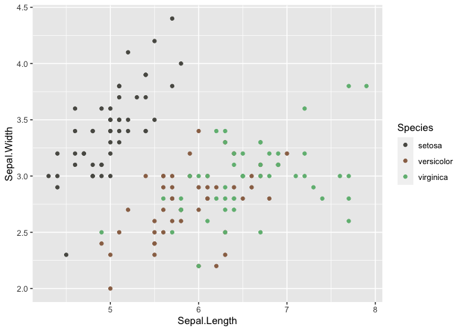

<!-- README.md is generated from README.Rmd. Please edit that file -->

# urbanC

The goal of the package **urbanC** is to introduce the new shades to R,
used in the city life.

## Installation

You can install the development version of urbanC with:

``` r
remotes::install_github("etc5523-2021/r-package-takehome-NishthaArora3008")
```

## Palettes

This package has one palette called the ‘warmCrush’ palette. It is
compatible with both discrete and continuous scales. It contains all the
subtle colours based on ‘Urban City Living Scheme’

## Example

This is a basic example which shows you how to solve a common problem:

``` r
library(ggplot2)
library(urbanC)

ggplot(iris, aes(Sepal.Length, Sepal.Width, color = Species)) +
  geom_point() +
  scale_color_warmCrush_d()
```


